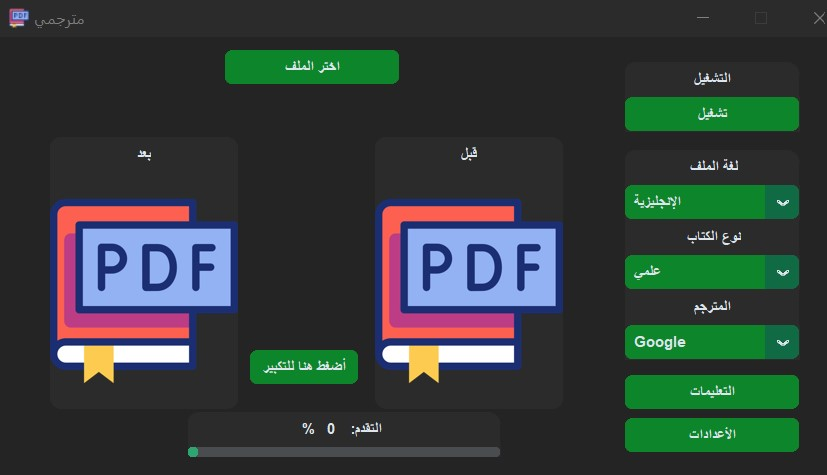
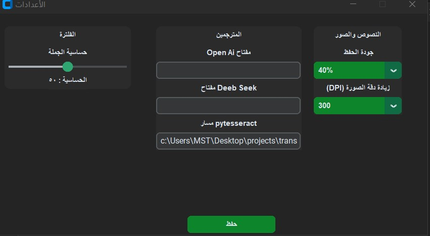
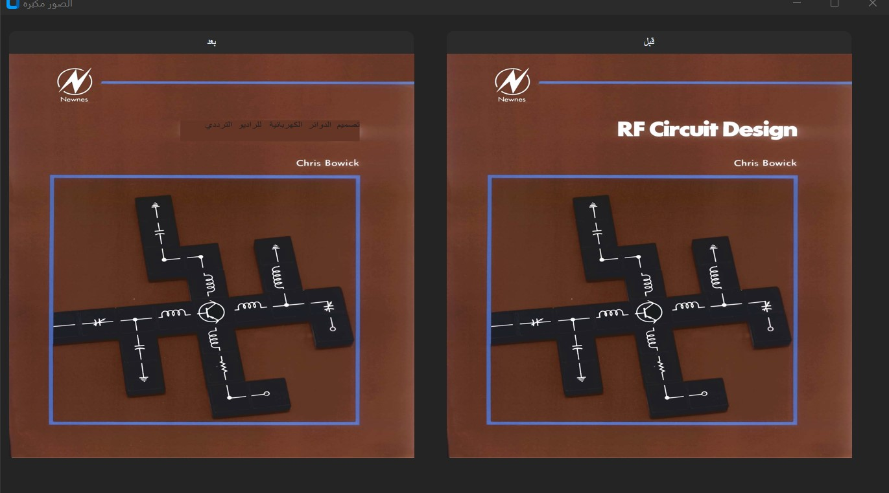
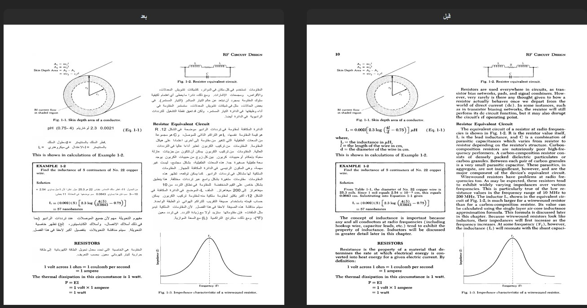

# ما هو برنامج مترجمي؟


برنامج مترجمي مصمم لترجمة ملفات PDF المصوره وخصيصاً الكتب  القديمة المصوّرة .
يعمل حالياً على نظام ويندوز
## صور البرنامج





## التحميل
بعد تحميل البرنامج انت بحاجة الى تثبيت Tesseract\n( محرك مكتشف النصوص )
حمله من الرابط التالي وضعه في مجلد البرنامج.

https://github.com/UB-Mannheim/tesseract/wiki

## تثبيت المكتبات
قم بهذا الأمر لتثبيت المكتبات المطلوبه
```
pip install -r requirements.txt
```


## الترجمة
هناك 3 انواع من المترجمين وهم
- Google (مجاني)
- OpenAi (مدفوع - يلزم مفتاح)
- Deebseek (مدفوع - يلزم مفتاح)

  الافضل في الترجمة هو OpenAi ويفضل في ترجمة الكتب الهندسية  ولكن بما انه مكلف تم توفير Deebseek لتقليل التكلفة الى الضعف
  وبالإمكان استخدام ترجمة Google لترجمة الملفات الادبية وليست الهندسية

  ## خطوات تشغيل عملية  الترجمة
  - اضغط على زر "اختيار الملف"واختر الملف بصيغة PDF
  - اختر المترجم
  - اختر نوع الملف
  - اختر لغة الملف
  - ثم اضغط على تشغيل
 
    سيحفظ الملف المترجم في مجلد output  بأسم الملف + output

    ## لغات الترجمة
    البرنامج يتيح ترجمة اكثر من 10 لغات ولكن بسبب ضخامه ملفات التدريب لم يتم ارفاقهم هنا
     ويمكنك تحميل ملفات التدريب من الرابط التالي
    https://github.com/tesseract-ocr/tessdata

    كل ملف تدريب يبدا برمز اللغة ثم صيغة التدريب وهي traineddata
    مثال:
    لغة الانجليزية رمزها eng
    وصيغه الملف traineddata
    إذا ستكون على النحو التالي
    eng.traineddata
    وهذي قائمة اللغات المدعومه مع الرموز
    ```
        "الإنجليزية": "eng",
        "الصينية": "chi_sim",
        "الإسبانية": "spa",
        "الفرنسية": "fra",
        "الهندية": "hin",
        "الروسية": "rus",
        "الألمانية": "deu",
        "اليابانية": "jpn",
        "الكورية": "kor",
        "الإيطالية": "ita",
        "البرتغالية": "por",
        "البنغالية": "ben",
        "البولندية": "pol",
        "الهولندية": "nld",
        "الماليزية": "msa",
        "التاميلية": "tam",
        "التايلاندية": "tha",
        "الفارسية": "fas",
        "الفلبينية": "fil"
    ```
    بعد التحميل ضع ملف التدريب في المسار tesseract\tessdata
    ومن ثم شغل البرنامج من جديد ويمكنك الترجمة بواسطته

     ## المطورين
    تم تطويره وبرمجته وتصميمه من قبل سلطان سامي

    ## المشاركة في التطوير
    اتمنى المشاركة في  تطويره وتحسينه ليكون افضل  لخدمة المجتمع

    

  
